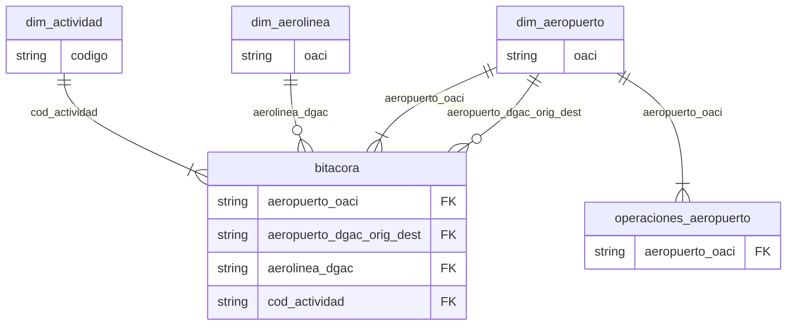

import CsvDocTable from '@site/src/components/CsvDocTable';
import DimAeropuertoCsv from '!!raw-loader!@site/docs/docs_data/dim_aeropuerto.csv';
import DimAerolineaCsv from '!!raw-loader!@site/docs/docs_data/dim_aerolinea.csv';
import DimActividadCsv from '!!raw-loader!@site/docs/docs_data/dim_actividad.csv';

# Dimensiones de las Series de Datos

En esta sección se especifican las tablas que se publican
en Datos.Gob relacionadas con las dimensiones de los datos
que se encargan de contextualizar o describir en mayor
detalle, columnas de las demás series de datos.

A continuación, el diagrama ([ER](https://en.wikipedia.org/wiki/Entity%E2%80%93relationship_model#Cardinalities))
muestra las relaciones entre estas dimensiones y las tablas de series:

Se omite el resto de las columnas de las tablas para simplificar el diagrama.

:::warning
La información que se presenta dentro de las dimensiones está
sujeta a posibles modificaciones.
:::

:::info
Los tipos de dato que presenten un signo de pregunta (`?`) al final
de su descripción, indica que la columna contiene valores nulos
o vacíos.
:::

## Dim Aeropuertos

La dimensión de aeropuertos y aerodromos contiene información
identificativa, normativa y geográfica de estos. La fuente de datos
proviene de la [DGAC](https://www.dgac.gob.cl/),
[IFIS](https://aipchile.dgac.gob.cl/),
[DAP](https://www.mop.gob.cl/category/direccion-de-aeropuertos/)
y [OurAirports](https://ourairports.com/).

<CsvDocTable csvData={DimAeropuertoCsv} />

## Dim Aerolineas

Contiene la descripción de las aerolineas que operan
(u operaron en algún momento) en Chile.
<CsvDocTable csvData={DimAerolineaCsv} />

## Dim Actividades DGAC

Presenta las actividades de la DGAC que describen
el motivo de la operación de una aeronave. Esto, registrado
en la bitácora de operaciones de la DGAC.
<CsvDocTable csvData={DimActividadCsv} />

## Información Técnica de los Archivos

Todos los archivos son cargados en formato `csv`, con codificación
`utf-8`, separado por comas y con cabecera.
